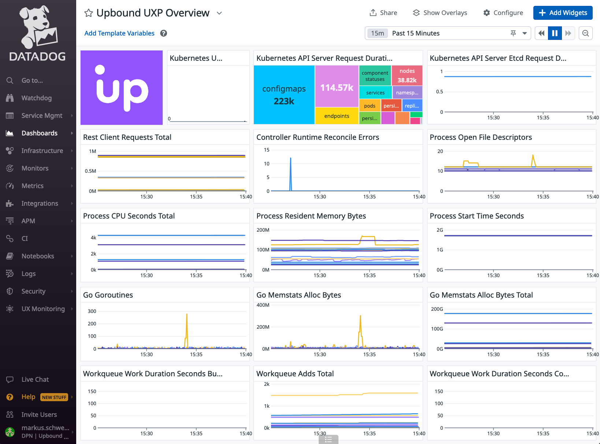
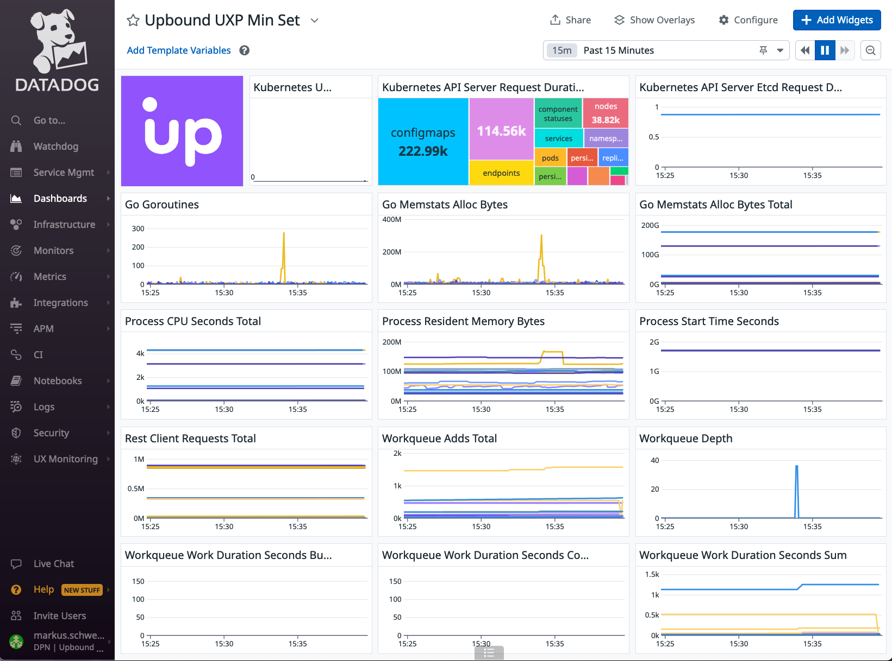
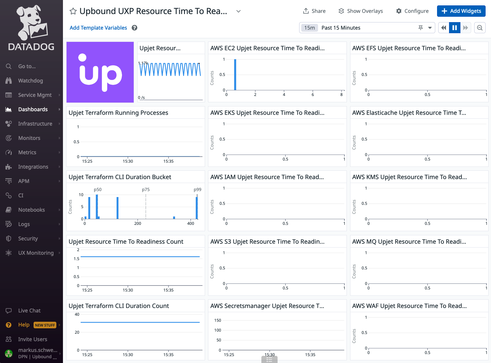

# configuration-observability-datadog
Configuration to set up a Datadog agent for Crossplane 
and Provider observability.

## Usage
Run `make e2e` to exercise end to end tests for the observability
integrations. It requires a DATADOG_API_KEY and DATADOG_APP_KEY. 
You may assign your API key also to the DATADOG_APP_KEY, if you
do not have a dedicated DATADOG_APP_KEY. Refer to
[Datadog API and Application Keys](https://docs.datadoghq.com/account_management/api-app-keys/)
for instructions for how to create these keys.

### Further Exploration
The `local-dev` cluster will remain after tests and you can run
`kubectl apply -f .up/examples/datadog.yaml` to install the agent
 and its dependencies.

### Dashboards
JSON for loadable dashboards is located in `.up/dashboards`.

### XPKG
The `_output` directory includes readily usable configuration packages
after `make build` has been run.

## Community
Feel free to join the
[SIG Observability Slack Channel](https://crossplane.slack.com/archives/C061GNH3LA0)
to participate in the Crossplane observability journey.
