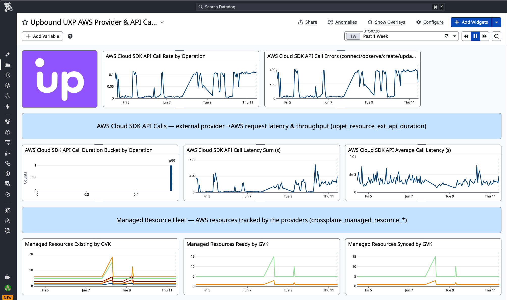
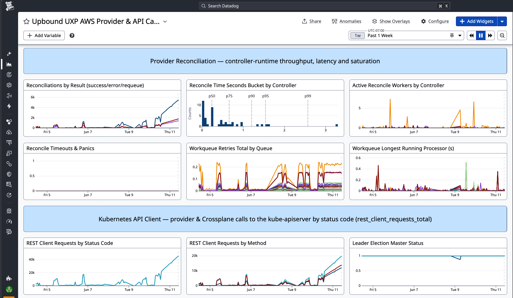
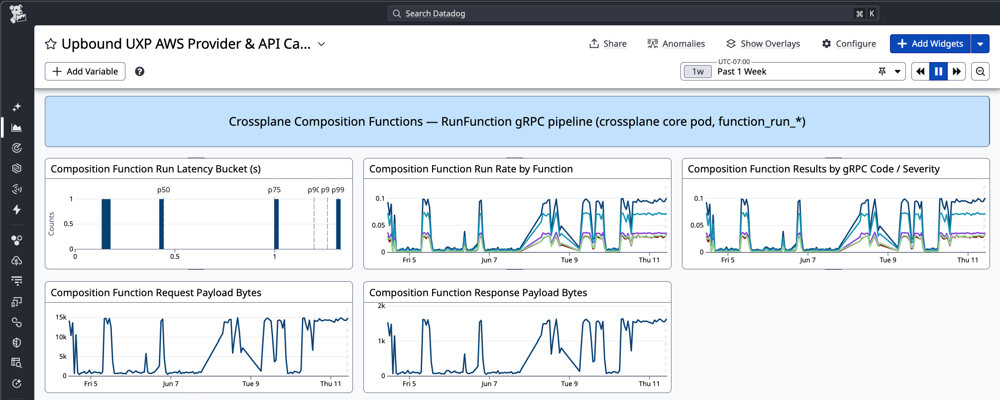
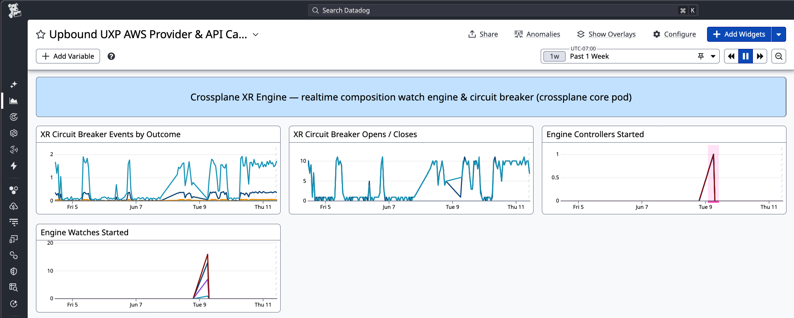
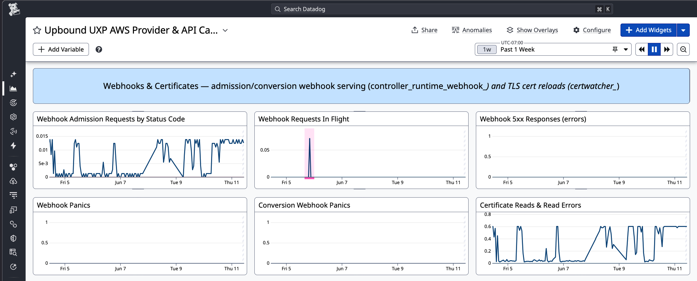
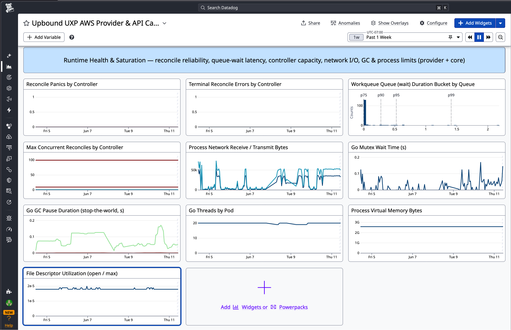
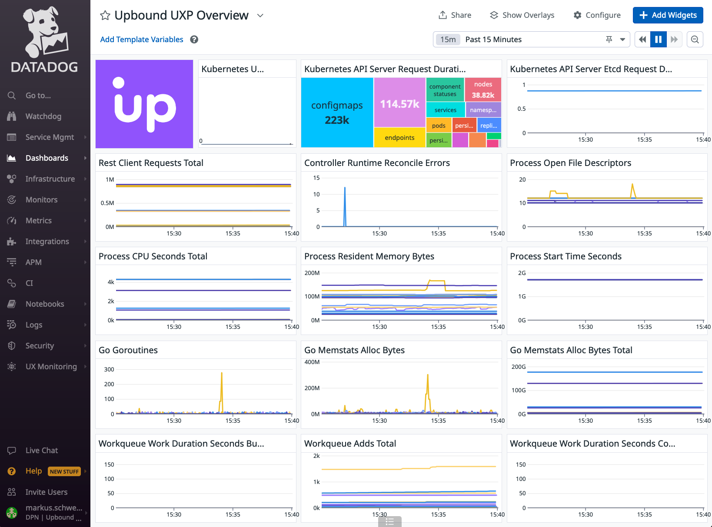
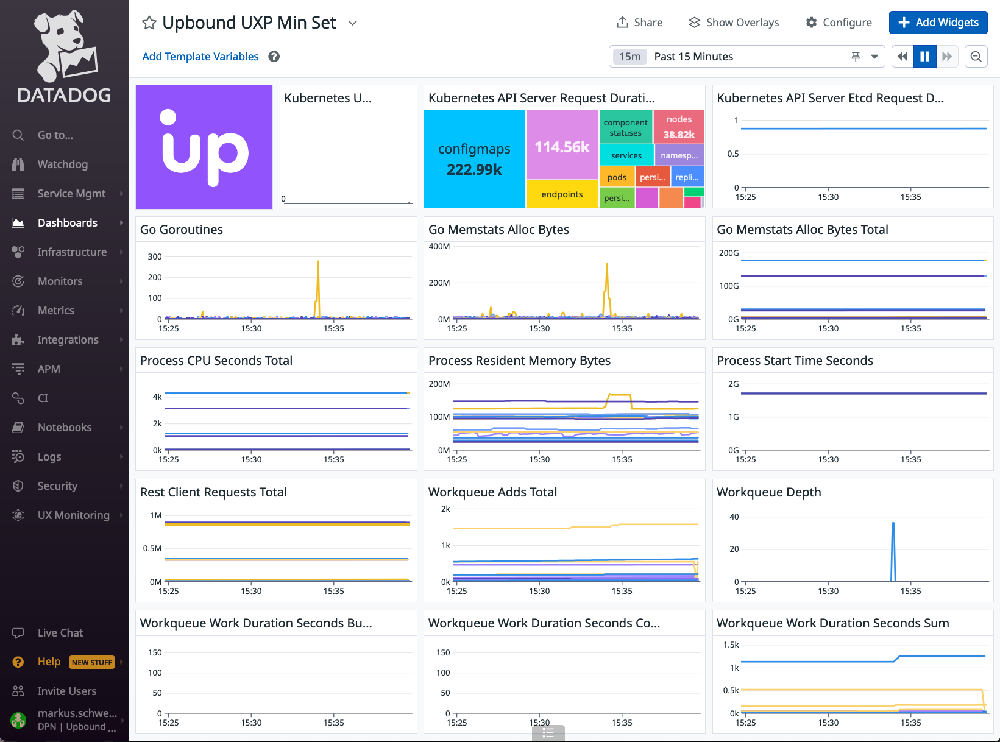
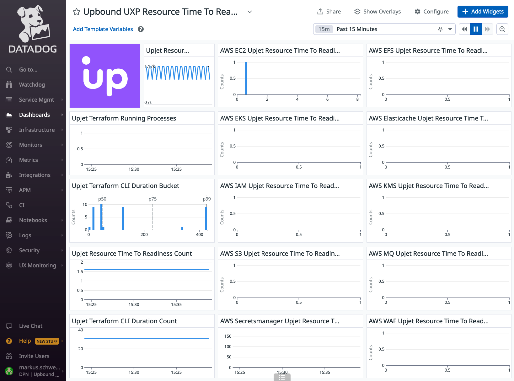

# configuration-observability-datadog
Configuration to set up a Datadog agent for Crossplane 
and Provider observability.

## Usage
Run `make e2e` to exercise end to end tests for the observability
integrations. It requires a DATADOG_API_KEY and DATADOG_APP_KEY. 
You may assign your API key also to the DATADOG_APP_KEY, if you
do not have a dedicated DATADOG_APP_KEY. Refer to
[Datadog API and Application Keys](https://docs.datadoghq.com/account_management/api-app-keys/)
for instructions for how to create these keys.

### Further Exploration
The `local-dev` cluster will remain after tests and you can run
`kubectl apply -f .up/examples/datadog.yaml` to install the agent
 and its dependencies.

### Dashboards
JSON for loadable dashboards is located in `.up/dashboards`.

Sample dashboards that are included in this repositary are
shown below. Note that some panels in those images coincidentally
do not show data. They do show that data when it is emitted.

#### Upbound UXP

#### Upbound UXP Overview

#### Upbound UXP Min Set

#### Upbound UXP MR TTR

#### Crossplane / AWS Provider Metrics & API Calls
`.up/dashboards/upbound_uxp_aws_api.json` complements the dashboards above
by surfacing metrics they omit, with an emphasis on the **AWS Cloud SDK
API calls** made by the Upbound AWS providers and on the Crossplane
composition pipeline.

**Collection path.** Unlike the three dashboards above — which read the
`uxp.*` metrics emitted by the `upbound_uxp` integration (running
`metrics_default: "min"`, a small allowlist) — this dashboard reads the
metrics produced by the Datadog Agent's `prometheusScrape` autodiscovery.
That path spins up a generic `openmetrics` check (`metrics: .*`,
`namespace: ""`) for every pod carrying the `prometheus.io/scrape`
annotation and ingests **all** exposed metrics with **no `uxp.` prefix**.
Names therefore follow OpenMetrics V2 conventions:

- counters end in `.count` (the Prometheus `_total` suffix is dropped),
  e.g. `function_run_function_request_total` →
  `function_run_function_request.count`;
- histograms expose `.bucket` / `.count` / `.sum` and the `le` label
  becomes the `upper_bound` tag;
- summaries expose `.quantile`;
- pods are tagged `pod_name` and `kube_deployment` (not `pod` / `host`).

Most of the metrics below are *not* in the `upbound_uxp` `min`/`more`
allowlists, so they are only available via this unprefixed path (or by
switching the integration to `metrics_default: "max"`).

Sections:

- **AWS Cloud SDK API Calls** – `upjet_resource_ext_api_duration`
  (`.bucket`/`.count`/`.sum`), labelled by `operation`
  (connect, observe, create, update, delete). Measures how long each
  Cloud SDK call to AWS takes, plus call rate and average latency.
- **Managed Resource Fleet** – `crossplane_managed_resource_exists`,
  `_ready` and `_synced`, broken out by `gvk`.
- **Provider Reconciliation** – `controller_runtime_reconcile.count`
  (by result), `controller_runtime_reconcile_time_seconds`,
  `controller_runtime_active_workers`,
  `controller_runtime_reconcile_timeouts.count`,
  `workqueue_retries.count` and
  `workqueue_longest_running_processor_seconds`.
- **Kubernetes API Client** – `rest_client_requests.count` by `code`
  and `method`, and `leader_election_master_status`.
- **Crossplane Composition Functions** – `function_run_function_seconds`,
  `function_run_function_request.count`, request/response payload bytes,
  and gRPC code / result severity.
- **Crossplane XR Engine** – `circuit_breaker_events.count`,
  `circuit_breaker_opens.count`/`_closes.count`,
  `engine_controllers_started.count` and `engine_watches_started.count`.
- **Webhooks & Certificates** – `controller_runtime_webhook_requests.count`
  (by `code` and `webhook`), `controller_runtime_webhook_requests_in_flight`,
  `controller_runtime_webhook_panics.count`,
  `controller_runtime_conversion_webhook_panics.count`, and TLS cert
  reloads via `certwatcher_read_certificate.count` / `_errors.count`.
- **Runtime Health & Saturation** –
  `controller_runtime_reconcile_panics.count`,
  `controller_runtime_terminal_reconcile_errors.count`,
  `workqueue_queue_duration_seconds` (time waiting in queue),
  `controller_runtime_max_concurrent_reconciles`,
  `process_network_receive_bytes.count` / `_transmit_bytes.count`,
  `go_sync_mutex_wait_total_seconds.count`, `go_gc_duration_seconds`,
  `go_threads`, `process_virtual_memory_bytes`, and open/max
  file-descriptor utilization.

A PNG preview is not included because rendering one requires loading the
JSON into a live Datadog account.

### XPKG
The `_output` directory includes readily usable configuration packages
after `make build` has been run.

## References
- [Datadog Upbound_UXP Integration](https://github.com/DataDog/integrations-extras/tree/master/upbound_uxp)
- [SIG Observability Slack Channel](https://crossplane.slack.com/archives/C061GNH3LA0)

## Community
Feel free to join the
[SIG Observability Slack Channel](https://crossplane.slack.com/archives/C061GNH3LA0)
to participate in the Crossplane observability journey.
